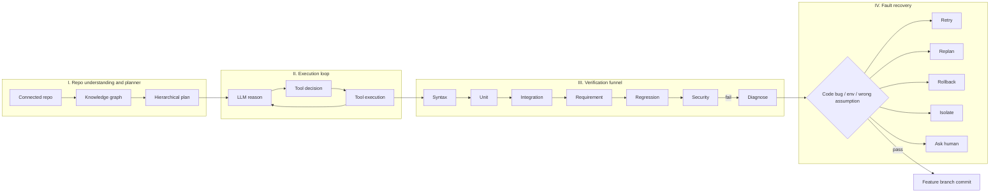
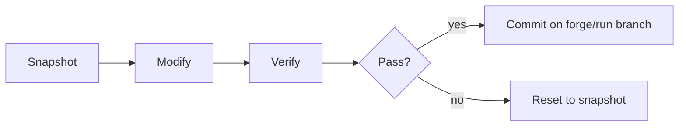

# FORGE

Fault-Resilient Orchestration for Reliable Generative Engineering.

Authors: Prasanth Muntha and Vipin Gattu.

Generating a snippet is not software engineering. Real work is long-horizon: the model has to understand a repository, keep a plan, notice when a check fails, and recover without burying the next step in the last mistake. Baseline agents cascade. A wrong assumption becomes wrong code, the tests are written to match that code, and the model "fixes" the failure by generating more of it.

FORGE is the harness around a small model:

**Planning + Verification + Recovery.**

The deliverable is a tested, explainable branch, not a raw completion.

## Architecture



Git checkpoints wrap each task: snapshot, edit, verify, commit on the run branch, or roll back.



### What each ablation turns on

| Config | Planning | Verification | Recovery | KG + context packs | Git checkpoints |
| --- | --- | --- | --- | --- | --- |
| `baseline` | | | | | |
| `planning` | yes | | | | |
| `planning_verify` | yes | yes | | | yes |
| `full_forge` | yes | yes | yes | yes | yes |

`configs/*.yaml` is the control surface: model, tools, funnel levels, max retries, and the risk threshold for Ask Human.

## Layout

```
configs/        baseline, planning, planning_verify, full_forge
backend/        FastAPI harness
frontend/       Vite + React + Tailwind dashboard
benchmarks/     task specs, hidden oracles, result files
examples/todo_api
```

## Quickstart with MockLLM

MockLLM is a deterministic stand-in for a small model. It is not a table of scores. It forgets `remove` when it rewrites a file it did not read, follows a checklist for easy requirements, and still gets tricky checks wrong until the verifier quotes the failure. The benchmark numbers are whatever that loop actually does.

```bash
cd backend
python -m venv .venv
source .venv/bin/activate
pip install -r requirements.txt
python -m pytest
python -m forge.cli serve
```

In another shell:

```bash
cd frontend
npm install
npm run dev
```

Open http://127.0.0.1:5173. Connect `examples/todo_api` (absolute path), index the graph, and run the sample goal with `full_forge`.

CLI equivalent:

```bash
cd backend
python -m forge.cli index ../examples/todo_api
python -m forge.cli run \
  --repo ../examples/todo_api \
  --config full_forge \
  --goal "Please add a way to mark a todo as done. When a todo is marked done, its done flag becomes true. Keep existing behavior. Add a unit test."
```

The run copies the repo into a workspace, so the example stays clean. The feature branch lives in that workspace.

## Ollama

Point the same loop at a local model. Nothing else in the harness changes.

```bash
# configs/full_forge.yaml  →  llm.provider: ollama, llm.model: llama3.2:3b
ollama pull llama3.2:3b
python -m forge.cli run \
  --repo ../examples/todo_api \
  --config full_forge \
  --provider ollama \
  --model llama3.2:3b \
  --goal "Please add a way to mark a todo as done so its done flag becomes true."
```

Other connectors, configured from the Providers page or `llm` in YAML:

| Provider | Default base |
| --- | --- |
| `lmstudio` | `http://127.0.0.1:1234/v1` |
| `huggingface` | `https://router.huggingface.co/v1` (`HF_TOKEN`) |
| `nvidia_nim` | `https://integrate.api.nvidia.com/v1` (`NVIDIA_API_KEY`) |
| `google` | Generative Language API (`GOOGLE_API_KEY`) |
| `openai_compat` | any `/v1` chat endpoint (`OPENAI_API_KEY`) |

Private GitHub repos clone with a personal access token. The token is stored in the local SQLite file and redacted from API responses.

## Ablations

```bash
cd backend
python -m forge.cli benchmark --repo ../examples/todo_api
```

Or pick a slice:

```bash
python -m forge.cli benchmark --repo ../examples/todo_api \
  --configs baseline,full_forge \
  --tasks simple_mark_done
```

The runner writes `benchmarks/results/<id>.json` and `.csv`. Metrics:

- **task completion** — fraction of hidden oracle checks that pass
- **recovery success** — resolved failures / failures, or blank when nothing failed
- **verification pass rate** — final-attempt funnel checks that passed
- **regression rate** — fraction of originally passing tests that fail afterward
- **human intervention rate** — 1 when recovery asks a person

Oracles live in `benchmarks/oracles/` and are not copied into the workspace.

Tasks:

- `simple_mark_done` — mark a todo done
- `medium_update_priority` — retitle, reject blanks, priority low/med/high
- `long_horizon_persist` — the above plus JSON persistence and priority filtering

## Tests

```bash
cd backend && python -m pytest
```

Covers the planner (including a garbage-model fallback), the knowledge graph, the verification funnel, recovery policy, and a MockLLM run of the simple goal on baseline versus full FORGE.

## API

REST under `/api` plus `GET /api/runs/{id}/events` as server-sent events. See `backend/forge/main.py`.
